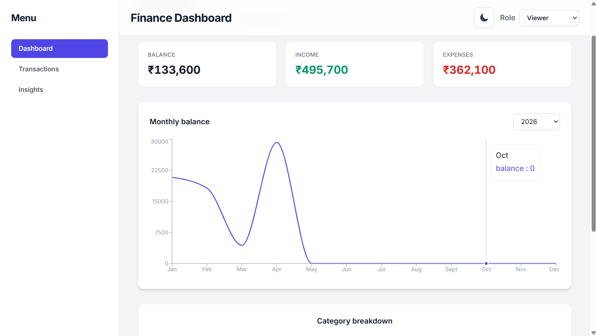
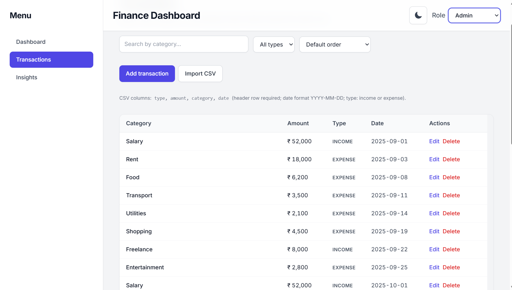
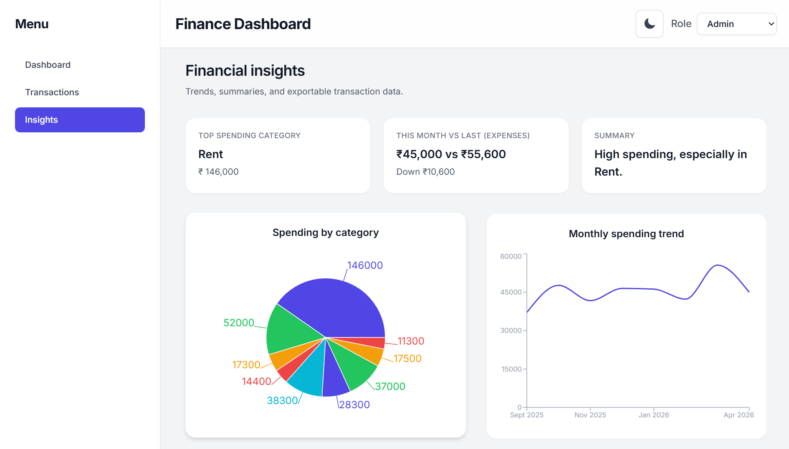

# Finance Dashboard

A responsive **personal finance dashboard** built with React. It supports CRUD-style management on **Transactions** (admin role), shows balances/charts on **Dashboard**, and surfaces trends plus CSV/JSON export on **Insights**. In production, it uses Vercel serverless API routes backed by Neon Postgres.

---

## Overview

| Area | What it does |
|------|----------------|
| **Dashboard** | Total balance, income, expenses; monthly balance line chart (year filter); category expense pie chart. |
| **Transactions** | Search, filter, sort; list + table layouts by screen size; admins can add, edit, and delete rows via the API. |
| **Insights** | Summary cards, category pie and spending trend charts, rule-based “smart” insights, downloadable data. |

**Tech stack:** React 19, React Router 7, Recharts, Tailwind CSS, Create React App.

**Data model:** `transactions` (`id`, `type`, `amount`, `category`, `date`). `db.json` is used as one-time seed data when the Neon table is empty.

---

## Screenshots

<p align="center">
  <b>Dashboard</b><br/>
  
</p>

<p align="center">
  <b>Transactions</b><br/>
  
</p>

<p align="center">
  <b>Insights</b><br/>
  
</p>

> **Tip:** These are vector previews that match the app structure. For real pixel captures, run the app and replace the files in [`docs/screenshots/`](./docs/screenshots/) with your own PNG or WebP images, then update the paths above if needed.

---

## Prerequisites

- **Node.js** 18+ (LTS recommended)
- **npm** (comes with Node)

---

## Setup

### 1. Clone and install

```bash
git clone https://github.com/sai-unknown/finance-dashboard
cd finance-dashboard
npm install
```

### 2. Configure environment

Copy `.env.example` to `.env.local` and set values as needed:

```bash
REACT_APP_API_URL=http://localhost:5000
DATABASE_URL=postgresql://...
```

- For local development with `db.json`, use `REACT_APP_API_URL=http://localhost:5000`.
- In Vercel production, `REACT_APP_API_URL` can be empty (same-origin `/transactions` is used).
- `DATABASE_URL` is required for Vercel serverless API.

### 3. Start the React app

Start local API from `db.json`:

```bash
npm run api:local
```

Then in a second terminal:

```bash
npm start
```

Open [http://localhost:3000](http://localhost:3000).

### 4. Roles

Use the header **Role** control:

- **Viewer** — read-only transactions (no add/edit/delete).
- **Admin** — full transaction form, CSV import, delete confirmation, pagination, and toasts for feedback.

### 5. CSV import (Transactions, admin)

Use **Import CSV** with a header row:

`type,amount,category,date`

- `type`: `income` or `expense`
- `amount`: positive number (commas allowed)
- `category`: any label
- `date`: `YYYY-MM-DD`

A tiny example file is at [`public/sample-transactions-import.csv`](./public/sample-transactions-import.csv).

### 6. Vercel production deployment

1. Import the repository into Vercel.
2. Add environment variables in Vercel project settings:
   - `DATABASE_URL` = your Neon connection string
   - `REACT_APP_API_URL` = optional (leave empty to use same-origin `/transactions`)
3. Redeploy.
4. Verify:
   - `GET /api/health`
   - `GET /api/transactions`
   - App loads data from `/transactions` successfully.

The project includes `vercel.json` rewrites:

- `/transactions` -> `/api/transactions`
- `/transactions/:id` -> `/api/transactions?id=:id`

---

## Available scripts

| Command | Description |
|---------|-------------|
| `npm start` | Dev server at port 3000 (hot reload). |
| `npm run api:local` | Local API from `db.json` at port 5000. |
| `npm run build` | Production build in `build/`. |
| `npm test` | Jest / React Testing Library (watch mode). |
| `npm run eject` | Irreversible CRA eject (only if you know you need it). |

---

## Troubleshooting

| Issue | What to try |
|-------|-------------|
| Empty data / fetch errors | On Vercel, verify `DATABASE_URL` is set and redeploy; test `/api/transactions` directly. |
| Local dev shows API errors | Ensure `npm run api:local` is running and `REACT_APP_API_URL=http://localhost:5000`. |
| Blank charts | Confirm transactions include valid `date` and `type` (`income` / `expense`). |

---

## Project structure (high level)

```
finance-dashboard/
├── public/
├── src/
│   ├── components/     # Header, Sidebar, MobileNav, …
│   ├── context/        # AppContext, ToastContext
│   ├── config/         # API_BASE (REACT_APP_API_URL)
│   ├── utils/          # CSV parsing for import
│   ├── hooks/          # useMediaQuery, …
│   ├── pages/          # Dashboard, Transactions, Insights
│   ├── App.js
│   └── index.js
├── docs/screenshots/   # README visuals
├── db.json             # seed data for first Neon bootstrap
└── README.md
```

---

## Learn more

- [Create React App documentation](https://facebook.github.io/create-react-app/docs/getting-started)
- [React documentation](https://react.dev/)
- [Vercel Functions](https://vercel.com/docs/functions/serverless-functions)

---

## Manual QA checklist

Run `npm run api:local` and `npm start`, open DevTools **Console**, then verify:

| Check | Expected |
|-------|-----------|
| **Dashboard** | Cards and charts load; year selector works; no red errors when API is up. |
| **Transactions** | Search / filters / sort; pagination; date on add/edit; CSV import; delete confirmation; toasts instead of blocking alerts. |
| **Insights** | Charts render; download switches JSON/CSV and saves a file. |
| **Role: Viewer** | No “Add transaction”, no Actions column, no edit inputs on rows. |
| **Role: Admin** | Add / edit / save / delete work; switching **Admin → Viewer** closes the add form and exits row edit mode. |
| **API off** | Friendly error message on pages that load data; no uncaught promise rejections. |
| **Responsive** | Resize 320px → 1920px+; bottom nav (mobile), sidebar (desktop); no horizontal page scroll. |
| **Console** | No errors in normal use (warnings from dev tools or extensions are OK). |

Automated: `npm run build` should compile with no errors.

---

## License

Private / assignment use